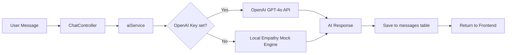

# Verity — Mental Health Support Chatbot
## Architecture Document

---

## Overview

Verity is a full-stack mental health support chatbot application built with a React (Vite) frontend and a Node.js/Express backend using SQLite for persistence. The AI persona "Verity" communicates with empathy and warmth, supported by a mood-tracking dashboard and persistent conversation history.

---

## Tech Stack

| Layer | Technology |
|---|---|
| Frontend | React 18, Vite, TailwindCSS, Lucide React |
| Routing | React Router v6 |
| State Management | React Context API + useReducer |
| Backend | Node.js, Express |
| Database | SQLite (via better-sqlite3) |
| Auth | JWT (JSON Web Tokens) + bcrypt |
| AI Service | Mock service (local) with OpenAI API hook |
| Charts | Recharts |
| HTTP Client | Axios |

---

## Folder Structure

```
Verity/
├── ARCHITECTURE.md
├── README.md
│
├── frontend/                         # React + Vite SPA
│   ├── index.html
│   ├── vite.config.js
│   ├── tailwind.config.js
│   ├── postcss.config.js
│   ├── package.json
│   └── src/
│       ├── main.jsx                  # App entry point
│       ├── App.jsx                   # Root component + Router
│       ├── index.css                 # Tailwind directives + global styles
│       │
│       ├── components/
│       │   ├── layout/
│       │   │   ├── Navbar.jsx        # Top bar with Verity smiley logo + nav links
│       │   │   ├── Sidebar.jsx       # Collapsible sidebar with conversation history
│       │   │   └── Layout.jsx        # Page wrapper (Sidebar + main content area)
│       │   ├── chat/
│       │   │   ├── ChatWindow.jsx    # Scrollable message list
│       │   │   ├── MessageBubble.jsx # Individual message with avatar + timestamp
│       │   │   └── ChatInput.jsx     # Textarea + Send button
│       │   ├── mood/
│       │   │   ├── MoodTracker.jsx   # Emoji mood picker (1-5 scale)
│       │   │   └── MoodChart.jsx     # Recharts line/bar chart of mood over time
│       │   ├── auth/
│       │   │   ├── LoginForm.jsx     # Email + password login form
│       │   │   └── RegisterForm.jsx  # Register with name, email, password
│       │   └── ui/
│       │       ├── Button.jsx        # Reusable button variants
│       │       ├── Input.jsx         # Reusable labeled input
│       │       └── Card.jsx          # White rounded card container
│       │
│       ├── pages/
│       │   ├── LandingPage.jsx       # Hero / welcome screen (unauthenticated)
│       │   ├── LoginPage.jsx         # /login
│       │   ├── RegisterPage.jsx      # /register
│       │   ├── ChatPage.jsx          # /chat — main chat interface
│       │   └── DashboardPage.jsx     # /dashboard — mood history + stats
│       │
│       ├── context/
│       │   ├── AuthContext.jsx       # User session + JWT storage
│       │   └── ChatContext.jsx       # Active conversation + message state
│       │
│       ├── hooks/
│       │   ├── useAuth.js            # Auth helpers (login, logout, register)
│       │   ├── useChat.js            # Chat send/receive, history load
│       │   └── useMood.js            # Mood log + fetch
│       │
│       ├── services/
│       │   ├── api.js                # Axios instance with JWT interceptors
│       │   ├── authService.js        # /api/auth/* calls
│       │   ├── chatService.js        # /api/chat/* calls
│       │   └── moodService.js        # /api/mood/* calls
│       │
│       └── utils/
│           └── helpers.js            # Date formatting, mood label maps, etc.
│
└── backend/                          # Node.js + Express API
    ├── server.js                     # Entry point, binds Express app
    ├── package.json
    └── src/
        ├── app.js                    # Express app, middleware, route mounting
        │
        ├── db/
        │   ├── database.js           # SQLite connection + init
        │   └── migrations.js         # Table creation (users, conversations, messages, moods)
        │
        ├── models/
        │   ├── User.js               # User CRUD
        │   ├── Conversation.js       # Conversation CRUD
        │   ├── Message.js            # Message CRUD
        │   └── MoodEntry.js          # MoodEntry CRUD
        │
        ├── routes/
        │   ├── auth.js               # POST /api/auth/register, /login, /me
        │   ├── chat.js               # GET/POST /api/chat/conversations/:id/messages
        │   └── mood.js               # GET/POST /api/mood
        │
        ├── controllers/
        │   ├── authController.js     # Auth business logic
        │   ├── chatController.js     # Chat business logic + AI call
        │   └── moodController.js     # Mood entry logic
        │
        ├── middleware/
        │   ├── authMiddleware.js     # JWT verify + attach req.user
        │   └── errorHandler.js       # Global error response formatter
        │
        └── services/
            └── aiService.js          # Empathetic mock responses + OpenAI hook
```

---

## Database Schema (SQLite)

### `users`
| Column | Type | Notes |
|---|---|---|
| id | INTEGER PK | Auto-increment |
| name | TEXT | Display name |
| email | TEXT UNIQUE | Login identifier |
| password_hash | TEXT | bcrypt hash |
| created_at | DATETIME | Default NOW |

### `conversations`
| Column | Type | Notes |
|---|---|---|
| id | INTEGER PK | |
| user_id | INTEGER FK | → users.id |
| title | TEXT | Auto-generated from first message |
| created_at | DATETIME | |
| updated_at | DATETIME | |

### `messages`
| Column | Type | Notes |
|---|---|---|
| id | INTEGER PK | |
| conversation_id | INTEGER FK | → conversations.id |
| role | TEXT | 'user' or 'assistant' |
| content | TEXT | Message body |
| created_at | DATETIME | |

### `mood_entries`
| Column | Type | Notes |
|---|---|---|
| id | INTEGER PK | |
| user_id | INTEGER FK | → users.id |
| score | INTEGER | 1 (very low) – 5 (excellent) |
| note | TEXT | Optional freetext |
| created_at | DATETIME | |

---

## API Routes

### Auth (`/api/auth`)
| Method | Route | Auth | Description |
|---|---|---|---|
| POST | `/register` | — | Create new account |
| POST | `/login` | — | Returns JWT |
| GET | `/me` | ✅ | Returns current user |

### Chat (`/api/chat`)
| Method | Route | Auth | Description |
|---|---|---|---|
| GET | `/conversations` | ✅ | List user's conversations |
| POST | `/conversations` | ✅ | Create new conversation |
| GET | `/conversations/:id/messages` | ✅ | Fetch conversation history |
| POST | `/conversations/:id/messages` | ✅ | Send message, receive AI reply |

### Mood (`/api/mood`)
| Method | Route | Auth | Description |
|---|---|---|---|
| GET | `/` | ✅ | Get all mood entries for user |
| POST | `/` | ✅ | Log a new mood entry |

---

## AI Service Architecture



The `aiService.js` checks for an `OPENAI_API_KEY` environment variable:
- **Present** → routes through OpenAI `gpt-4o` with a system prompt defining Verity's empathetic persona
- **Absent** → uses a curated local response library with keyword-triggered empathetic replies

---

## Frontend Routing

```mermaid
graph TD
  Root[/] --> Landing[LandingPage]
  Root --> Login[/login → LoginPage]
  Root --> Register[/register → RegisterPage]
  Root --> ProtectedChat[/chat → ChatPage PROTECTED]
  Root --> ProtectedDash[/dashboard → DashboardPage PROTECTED]
  ProtectedChat --> ConvID[/chat/:conversationId]
```

---

## Theming

- **Primary accent**: `yellow-400` / `#FACC15`
- **Background**: `neutral-50` / `#FAFAFA`
- **Surface cards**: `white` with `neutral-100` borders
- **Text**: `neutral-800` primary, `neutral-500` muted
- **Smiley Logo**: Lucide `Smile` icon styled with `text-yellow-400`, rendered in Navbar and Sidebar header
- **AI messages**: Soft `yellow-50` background
- **User messages**: `neutral-800` background, white text

---

## Local Storage Strategy

- `verity_token` — JWT stored in `localStorage`
- `verity_user` — Serialized user object cached in `localStorage`
- Conversation messages are **always persisted** to SQLite via API; localStorage used only for session token

---

## Environment Variables

### Backend (`backend/.env`)
```
PORT=3001
JWT_SECRET=your_jwt_secret_here
OPENAI_API_KEY=             # Optional — falls back to mock service
DB_PATH=./verity.db
```

### Frontend (`frontend/.env`)
```
VITE_API_BASE_URL=http://localhost:3001
```
